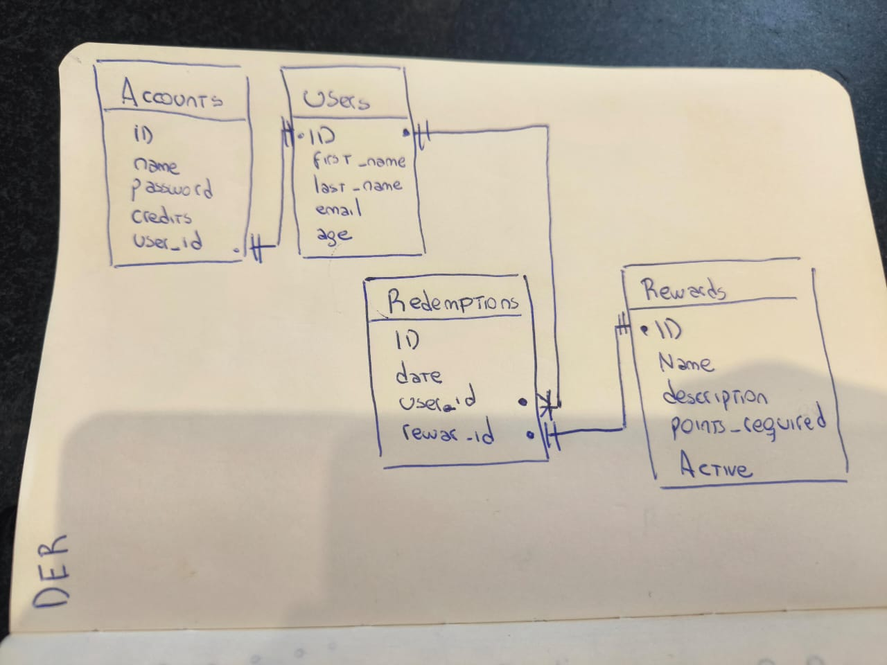

# rewards

## Prerequisites
[Docker](https://www.docker.com/) installed on your machine

## Clone the Repository:
```
git clone https://github.com/Frachuk/rewards.git
```

```
cd rewards
```

## How to start the three services in docker

```
docker compose --env-file ./rewards-backend/.env up --build --remove-orphans
```
- The docker compose will build and start postgres, backend and frontend services.

# Frontend

This service was built using:

- [React](https://es.react.dev/)
- [ChakraUI](https://chakra-ui.com/)
- [Vite](https://vitejs.dev/)

# Backend

This service was built using:

- [Node](https://nodejs.org/en)
- [Express](https://expressjs.com/)
- [Knex](https://knexjs.org/)

# DB

- [Postgres](https://www.postgresql.org/)




The compose file will expose the following URLs

- Frontend: http://localhost:5173
- Backend: http://localhost:3000
- Postgres: http://localhost:5432

## Stopping the Services:
To stop the running services, press Ctrl + C in the terminal where Docker Compose is running.